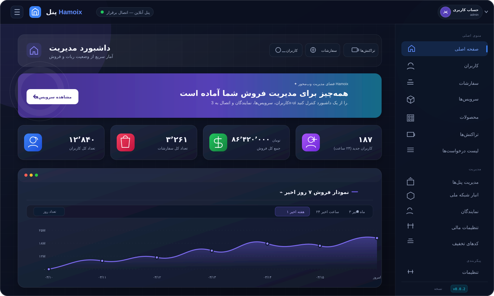

# Hamoix — پنل وب فروش و مدیریت سرویس VPN

Hamoix یک سامانه‌ی وب‌محور برای فروش، مدیریت و نمایندگی سرویس‌های VPN است. این نسخه برای اجرا روی **VPS، سرور اختصاصی، cPanel و aaPanel** آماده شده و تمام عملیات اصلی از طریق پنل وب انجام می‌شود.

> **وضعیت این نسخه:** ربات تلگرام و مینی‌اپ از مسیر اجرایی محصول حذف شده‌اند. نام بعضی جدول‌ها و فیلدهای قدیمی در لایه‌ی مهاجرت دیتابیس ممکن است برای سازگاری با دیتابیس‌های قبلی باقی مانده باشد، اما نصب و استفاده‌ی جدید به توکن، webhook یا ربات تلگرام نیاز ندارد.

## نمایی از داشبورد

<p align="center">
  
</p>

> تصویر بالا از رابط واقعی داشبورد فعلی Hamoix ساخته شده است؛ اعداد داخل تصویر صرفاً داده‌ی نمونه هستند و هیچ اطلاعات واقعی یا حساسی در آن استفاده نشده است.

---

## امکانات اصلی

### پنل مدیریت کل

- داشبورد آماری با فروش، کاربران، سفارش‌ها و نمودار بازه‌ای فروش
- مدیریت کاربران، سرویس‌ها، سفارش‌ها، پرداخت‌ها و موجودی
- مدیریت محصولات، دسته‌بندی، تخفیف، کد هدیه و انبار سرویس
- مدیریت چند پنل سرویس و تست اتصال/احراز هویت
- مدیریت نمایندگان فروش، سقف موجودی، سقف ساخت سرویس و محصولات مجاز
- افزایش/کسر موجودی نماینده با ثبت در دفتر حسابداری
- بررسی، تأیید یا رد درخواست برداشت نمایندگان با جلوگیری از پردازش تکراری
- تنظیمات عمومی، درگاه‌ها، پروکسی اتصال به پنل‌ها و تنظیمات کرون
- ورود امن‌تر با session regeneration، CSRF در عملیات حساس و logout واقعی

### پنل نماینده

- ورود مستقل برای هر نماینده
- داشبورد موجودی، فروش و سرویس‌های فعال
- خرید/ساخت سرویس از محصولات مجاز مدیر
- تمدید سرویس و تغییر رمز سرویس
- مدیریت سرویس‌های ساخته‌شده و مشاهده‌ی لینک اشتراک/اتصال
- کیف پول و دفترچه‌ی تراکنش‌ها
- شارژ از درگاه‌های فعال‌شده و ثبت درخواست برداشت
- گزارش فروش، سرویس‌ها و تراکنش‌ها
- محدودیت موجودی، تعداد سرویس و دسترسی محصول بر اساس تنظیمات مدیر

### اتصال به پنل‌های سرویس

Hamoix برای مدل‌های مختلف پنل سرویس آماده شده است، از جمله:

- **3x-ui / Sanaei single** با پشتیبانی از API Token در نسخه‌های جدید
- Marzban
- Marzneshin
- Hiddify
- Guard / GuardCore
- WGDashboard
- MikroTik و IBSNG
- Manual sale و چند adapter دیگر موجود در پروژه

در اتصال به نسخه‌های جدید 3x-ui، توکن API روش پیشنهادی است. Hamoix مسیرهای جدید `/panel/api/clients/*` را برای عملیات کلاینت‌ها پشتیبانی می‌کند و تبدیل quota از bytes به `totalGB` را در مرز API انجام می‌دهد.

### ظاهر و تجربه کاربری

- پوسته‌ی مشترک **Aurora Dark** با پس‌زمینه‌ی تیره، پنل‌های شیشه‌ای و رنگ‌های بنفش، آبی و فیروزه‌ای
- طراحی responsive برای موبایل، تبلت و دسکتاپ
- تم روشن/تیره و انتخاب رنگ accent
- داشبوردهای مدیر و نماینده با ساختار و کامپوننت‌های بصری هماهنگ
- صفحه‌ی Subscription مستقل با QR، کپی لینک و نمایش وضعیت اتصال
- Wizard نصب با ظاهر جدید، ورودی‌های امن‌تر و روند کاملاً وب‌محور

---

## معماری و مسیرهای مهم

```text
.
├── installer/           Wizard نصب وب و ساخت/مهاجرت دیتابیس
├── panel/               پنل مدیریت کل
│   └── reseller/        پنل مستقل نماینده
├── payment/             callback و adapter درگاه‌های پرداخت
├── cron/                وظایف دوره‌ای و diagnostics
├── re/                  منطق اتصال و adapterهای پنل‌های سرویس
├── x-ui_single.php      اتصال legacy و token-mode برای 3x-ui
├── table.php            ایجاد و ارتقای جدول‌های دیتابیس
├── function.php         helperها و منطق مشترک PHP
├── config.php           تنظیمات اتصال دیتابیس و origin برنامه
├── composer.json        وابستگی‌های PHP
└── DEPLOY_VPS.md        راهنمای کامل استقرار روی VPS
```

---

## نیازمندی‌های فنی

- PHP **8.2 یا بالاتر**
- PHP CLI و PHP-FPM برای اجرای وب و cron
- MySQL یا MariaDB
- وب‌سرور Nginx یا Apache
- Composer 2
- دامنه با HTTPS معتبر؛ برای نصب و callback درگاه‌ها HTTPS الزامی است
- افزونه‌های PHP:
  - `pdo_mysql` و `mysqli`
  - `curl`
  - `mbstring`
  - `xml`
  - `intl`
  - `gd`
  - `zip`
  - `bcmath`
  - `sodium` یا بسته‌ی سازگار موجود در Composer

وابستگی‌های PHP در `composer.json` تعریف شده‌اند:

- `endroid/qr-code`
- `phpoffice/phpspreadsheet`
- `paragonie/sodium_compat`

---

## نصب سریع روی VPS

اگر DNS دامنه از قبل به IP سرور اشاره می‌کند و پورت‌های **80 و 443** باز هستند، نصب کامل را با یک دستور انجام دهید. دستور زیر PHP 8.2+، MariaDB، Nginx، Composer، HTTPS و cron را نصب می‌کند، سورس را دریافت می‌کند و دامنه را به پنل متصل می‌کند:

```bash
curl -fsSL https://raw.githubusercontent.com/hamed9898/HaMoix/main/install-hamoix.sh | sudo bash -s -- panel.example.com admin@example.com
```

ایمیل اختیاری است و برای اعلان‌های تمدید گواهی Let's Encrypt استفاده می‌شود. اگر ایمیل را حذف کنید، گواهی بدون اعلان ایمیلی ثبت می‌شود:

```bash
curl -fsSL https://raw.githubusercontent.com/hamed9898/HaMoix/main/install-hamoix.sh | sudo bash -s -- panel.example.com
```

اسکریپت این کارها را انجام می‌دهد:

1. نصب PHP 8.2 یا بالاتر، افزونه‌های مورد نیاز، MariaDB، Nginx، Composer و Certbot
2. ساخت دیتابیس و کاربر اختصاصی Hamoix
3. دریافت آخرین سورس از همین repository و نصب وابستگی‌های Composer
4. تنظیم Nginx و دریافت گواهی HTTPS برای دامنه
5. ثبت cron بررسی انقضای سرویس‌ها و آماده‌سازی مسیر `/installer/`

در پایان، اسکریپت آدرس Wizard و اطلاعات دیتابیس را چاپ می‌کند. سپس این آدرس را باز کنید:

```text
https://panel.example.com/installer/
```

اطلاعات دیتابیس چاپ‌شده را در Wizard وارد کنید و رمز مدیر را تعیین کنید. بعد از تکمیل Wizard، پوشه‌ی `installer` به‌صورت خودکار حذف می‌شود و ورود از مسیر زیر انجام می‌شود:

```text
https://panel.example.com/panel/login.php
```

> قبل از اجرا، رکورد A/AAAA دامنه را روی IP همین سرور قرار دهید. اطلاعات دیتابیس در فایل root-only `/root/.hamoix-db-credentials` ذخیره می‌شود؛ آن را در repository یا log عمومی قرار ندهید.

راهنمای کامل شامل نصب دستی، اتصال 3x-ui، تنظیمات SSL، cron و OPcache در فایل زیر قرار دارد:

➡️ [راهنمای استقرار روی VPS](DEPLOY_VPS.md)

### نصب جایگزین روی پورت 8443

اگر پنل VPN یا سرویس دیگری پورت‌های 80 و 443 را اشغال کرده است، از نصب‌کننده‌ی جایگزین استفاده کنید. این نسخه تمام Hamoix را روی HTTPS پورت 8443 اجرا می‌کند:

```bash
curl -fsSL https://raw.githubusercontent.com/hamed9898/HaMoix/main/install-hamoix-8443.sh | sudo bash -s -- panel.example.com admin@example.com
```

در این حالت مسیر نصب به شکل زیر خواهد بود:

```text
https://panel.example.com:8443/installer/
```

پورت **8443/TCP** را در فایروال باز کنید. چون صدور خودکار Let's Encrypt به پورت‌های استاندارد 80/443 نیاز دارد، نصب‌کننده‌ی 8443 یک گواهی self-signed می‌سازد و مرورگر در اولین ورود هشدار امنیتی نشان می‌دهد؛ برای ورود به Wizard باید گزینه‌ی ادامه/پذیرش گواهی را انتخاب کنید. برای استفاده‌ی عمومی، بعداً می‌توانید گواهی معتبر دامنه را روی همین Nginx جایگزین کنید. اگر UFW فعال باشد، اسکریپت پورت انتخاب‌شده را خودکار مجاز می‌کند.

همین نصب‌کننده برای پورت آزاد دیگری هم قابل استفاده است؛ عدد پورت را به‌عنوان آرگومان سوم بدهید:

```bash
curl -fsSL https://raw.githubusercontent.com/hamed9898/HaMoix/main/install-hamoix-8443.sh | sudo bash -s -- panel.example.com admin@example.com 9443
```

در این نمونه آدرس Wizard برابر `https://panel.example.com:9443/installer/` است. برای حذف ایمیل و تعیین پورت، آرگومان ایمیل را خالی بگذارید: `... | sudo bash -s -- panel.example.com "" 9443`.

---

## نصب روی cPanel یا aaPanel

1. فایل ZIP نسخه را در ریشه‌ی دامنه یا پوشه‌ی دلخواه آپلود و Extract کنید.
2. PHP را روی نسخه‌ی 8.2 یا بالاتر قرار دهید.
3. افزونه‌های مورد نیاز PHP را فعال کنید.
4. در صورت دسترسی SSH، در ریشه‌ی پروژه اجرا کنید:

   ```bash
   composer install --no-dev --no-interaction --prefer-dist
   ```

5. یک دیتابیس MySQL و کاربر آن بسازید.
6. آدرس زیر را باز کنید:

   ```text
   https://YOUR-DOMAIN/installer/
   ```

7. بعد از نصب، پوشه‌ی `installer` را حذف یا با rule وب‌سرور مسدود کنید.
8. cron را از بخش Cron Jobs هاست تنظیم کنید.

برای جزئیات سنتی هاست می‌توانید از [راهنمای هاست](host.md) استفاده کنید؛ در نسخه‌ی وب‌محور، هرجا در مستندات قدیمی از ربات یا مینی‌اپ صحبت شده است، آن بخش را نادیده بگیرید.

---

## نصب و اتصال 3x-ui

Hamoix خودش پنل 3x-ui را نصب نمی‌کند. ابتدا 3x-ui را روی VPS سرویس نصب کنید:

```bash
bash <(curl -Ls https://raw.githubusercontent.com/MHSanaei/3x-ui/master/install.sh)
```

در 3x-ui:

1. یک Inbound مناسب، مانند VLESS + Reality، بسازید.
2. از بخش تنظیمات امنیتی، API Token بسازید.
3. شناسه‌ی Inbound و لینک Subscription را یادداشت کنید.
4. در Hamoix به **پنل‌ها** بروید و نوع `x-ui_single` را انتخاب کنید.
5. آدرس پنل، توکن API، شناسه‌ی Inbound و لینک Subscription را وارد کنید.
6. قبل از ساخت محصول، دکمه‌ی تست اتصال را اجرا کنید.

برای نصب‌های قدیمی‌تر، فیلد username/password نیز در adapter حفظ شده است؛ برای نسخه‌های جدید 3x-ui، **API Token توصیه می‌شود**.

---

## تنظیم cron

کرون برای بررسی انقضا، وضعیت سرویس‌ها، پاک‌سازی و کارهای دوره‌ای ضروری است:

```cron
* * * * * php /var/www/hamoix/cron/cron.php >/dev/null 2>&1
```

برای عیب‌یابی موقت می‌توانید لاگ بگیرید:

```cron
* * * * * php /var/www/hamoix/cron/cron.php >> /var/www/hamoix/logs/cron.log 2>&1
```

مسیر diagnostics:

```text
/var/www/hamoix/cron/diag.php
```

پس از اطمینان از عملکرد، لاگ‌های حساس را در مسیر عمومی وب نگه ندارید و دسترسی آن‌ها را محدود کنید.

---

## درگاه‌های پرداخت و تنظیمات مالی

Hamoix adapterهای چند روش پرداخت را در اختیار دارد. روش‌های قابل استفاده به پیکربندی نسخه و فعال‌سازی از پنل بستگی دارند و می‌توانند شامل موارد زیر باشند:

- کارت‌به‌کارت و تأیید دستی
- درگاه‌های ریالی مانند ZarinPal، Zarinpey، Aqayepardakht و IranPay
- پرداخت‌های رمزارزی مانند NowPayments، Plisio و Tron

برای هر درگاه:

1. callback را فقط روی HTTPS قرار دهید.
2. کلیدها و merchant/API token را در پنل مدیریت وارد کنید.
3. حداقل و حداکثر مبلغ را تنظیم کنید.
4. قبل از استفاده‌ی عمومی، یک تراکنش کم‌مبلغ آزمایشی انجام دهید.

کلیدهای پرداخت را در README، log یا commit قرار ندهید.

---

## امنیت قبل از انتشار

- HTTPS را اجباری کنید و گواهی معتبر نصب کنید.
- بعد از نصب، `installer/` را حذف یا مسدود کنید.
- `config.php`، `vendor/` و فایل‌های log را از دسترسی عمومی خارج کنید.
- توکن API پنل‌ها و کلید درگاه‌ها را فقط در دیتابیس/تنظیمات امن سرور ذخیره کنید.
- دسترسی پورت 3x-ui را با فایروال محدود کنید؛ ترجیحاً فقط IP سرور Hamoix مجاز باشد.
- برای ادمین‌ها و نمایندگان رمزهای یکتا و طولانی استفاده کنید.
- از دیتابیس به‌صورت منظم backup بگیرید و backup را روی همان سرور نگه ندارید.
- قبل از حذف یا مهاجرت، از `config.php` و دیتابیس نسخه‌ی پشتیبان بگیرید.
- در محیط production مقدار `display_errors` را خاموش و `log_errors` را فعال نگه دارید.

نمونه‌ی backup:

```bash
mkdir -p /root/backups
mysqldump -u hamoix -p hamoix | gzip > "/root/backups/hamoix_$(date +%F).sql.gz"
```

---

## عیب‌یابی سریع

### صفحه سفید یا خطای 500

- نسخه‌ی PHP را بررسی کنید: `php -v`
- اگر Composer خطای `Class "Normalizer" not found` یا نبودن `curl` داد، مطمئن شوید همان نسخه‌ای که CLI اجرا می‌کند افزونه‌ها را دارد؛ مثلاً برای PHP 8.2:

  ```bash
  php8.2 -m | grep -E '^(curl|intl|mbstring|mysqli|pdo_mysql|gd|zip|xml|bcmath)$'
  php8.2 /usr/bin/composer install --no-dev --no-interaction --prefer-dist
  ```

  نصب‌کننده‌ی سریع Hamoix از CLI نسخه‌دار استفاده می‌کند تا `php8.2-*` با PHP فعال دیگری قاطی نشود.
- افزونه‌های PHP و Composer را بررسی کنید.
- لاگ PHP-FPM و وب‌سرور را بخوانید.
- syntax فایل‌ها را بررسی کنید:

  ```bash
  find . -type f -name '*.php' -not -path './vendor/*' -print0 \
    | xargs -0 -n1 php -l
  ```

### خطای اتصال دیتابیس

- نام دیتابیس، username و password را بررسی کنید.
- دسترسی کاربر به دیتابیس و host را بررسی کنید.
- سرویس MariaDB/MySQL را بررسی کنید:

  ```bash
  systemctl status mariadb
  ```

### تست اتصال 3x-ui ناموفق است

- آدرس را بدون path اشتباه و با HTTPS وارد کنید.
- دسترسی فایروال و DNS را بررسی کنید.
- معتبر بودن API Token را در خود 3x-ui بررسی کنید.
- شناسه‌ی Inbound و مسیر پنل را دوباره بررسی کنید.
- در صورت نیاز، پروکسی اتصال پنل را از تنظیمات Hamoix فعال کنید.

### cron اجرا نمی‌شود

- مسیر کامل PHP و پروژه را در crontab استفاده کنید.
- خروجی cron را موقتاً در log ذخیره کنید.
- `cron/diag.php` و لاگ PHP را بررسی کنید.

---

## بررسی توسعه‌دهنده

این پروژه PHP است و فایل TypeScript ندارد. برای بررسی syntax تمام فایل‌های PHP:

```bash
find . -type f -name '*.php' -not -path './vendor/*' -print0 \
  | xargs -0 -n1 php -l
```

برای بررسی Composer:

```bash
composer validate
composer install --no-dev --no-interaction --prefer-dist
```

---

## مستندات مرتبط

- [استقرار کامل روی VPS](DEPLOY_VPS.md)
- [راهنمای هاست cPanel / aaPanel](host.md)
- [installer وب‌محور VPS](install-hamoix.sh)
- [installer جایگزین پورت 8443](install-hamoix-8443.sh)
- [مخزن 3x-ui](https://github.com/MHSanaei/3x-ui)

---

## مجوز و مسئولیت استفاده

این پروژه تحت مجوز موجود در فایل [LICENSE](LICENSE) منتشر شده است. مسئولیت تنظیم صحیح امنیت سرور، رعایت قوانین محل استفاده، حفاظت از اطلاعات کاربران و نگهداری backup بر عهده‌ی مدیر سرویس است.

اگر پروژه برایتان مفید بود، با دادن ⭐ به repository به توسعه‌ی آن کمک کنید.
